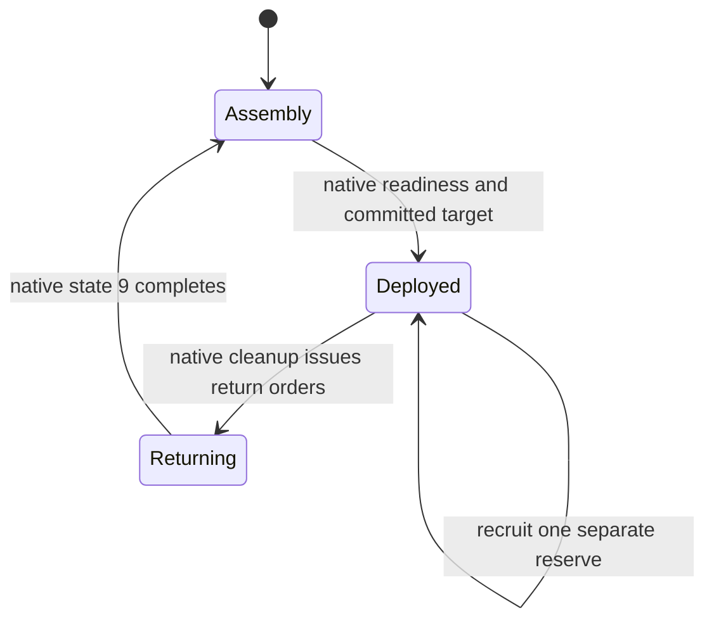

# Combat policy integration

Source implementation on `feat/combat-integration`; built with MSVC2005 SP1
with warnings treated as errors. Component and native-layout checks pass; this
integration has not yet been accepted in a running game.

## Ownership and activation

The native 1.41 AI scheduler, recruitment/acquisition functions, unit/group pools,
wave writer, commands, path-area graph and RNG remain the execution owners.
The module stores additional configuration outside the fixed 676-byte native AIC
record. Runtime state belongs to player slots, so repeated Wolf/Saladin characters
have independent targets, reserves, incidents and raid groups.

Omitted fields retain their authored values during partial updates. Whole-AI reset
restores defaults. New policies can change only before the first simulation tick
in a fresh process; live conversion of deployed groups is unsupported. Original
fields remain readable and writable through AIC Loader, without altering their
meaning or disabling an opted-in policy.

| Control | Default | Effective behavior / precedence |
| --- | --- | --- |
| `AttackTargetPolicy` | `Inherit` | Reuse `TargetChoice`; explicit policies replace opponent selection only. `LastAggressor` falls back to `TargetChoice` without a valid incident. |
| `AttackTargetCommitment` | `Default` | Resolve to `PerAttack` for a new target policy **or `DuringAttack` preparation**. Otherwise retain Native/Legacy commitment. Explicit `UntilDefeated` takes precedence over later incidents and changing rankings. |
| `AttackPreparation` | `Native` | `DuringAttack` permits one reserve using the existing next-wave requirement; it also keeps the deployed target fixed. It does not change opponent ranking, raid policy or recruitment weights. |
| `AttackActivation` | `Immediate` | `AfterProvocation` blocks offensive armies and raids until a qualifying incident; awakening lasts for the match. Defense and protective sorties continue. |
| `RaidTargetPolicy` | `Native` | New policies use the existing total raid budget, roster and retarget interval. Auxiliary raid settings require a new policy; `RaidFocus` needs `Opportunistic`. |

`Default` remains the authored commitment when preparation resolves it to
`PerAttack`. Switching preparation back to `Native` therefore restores the old
commitment unless another new target policy or explicit commitment is present.

## Main army and reserve

The original wave writer at `0x4CDE60` increments the wave once, at launch, and
computes the next size adjustment. Reserve size is `AttForceBase` plus that
adjustment, bounded by the native 2,500-unit pool. Engineers retain their separate
native quota. Native/Legacy growth and caps are not reimplemented or applied twice.
The original weak-opponent discount is retained except for `Random + PerAttack`:
that combination waits for the full computed requirement and draws its opponent
only after readiness, so a provisional native opponent cannot discount a random wave.

Reserve recruitment temporarily supplies its own 22 group references, counts and
roster cursor to the original recruitment call, then restores the deployed values.
Both sets of groups are ordinary native tribes allocated within the player's
existing partition. Native membership operations maintain unit IDs/UIDs, group
sizes, bitsets and movement speeds. The reserve is excluded from active-army
counters and protected from the native tunneler reassignment helper; the native
engineer helpers already exclude grouped engineers.

At handover, transfer at most 16 units and inspect at most 64 membership words per
AI update. Survivors keep their groups; the reserve fills available role/size
capacity. Surplus troops remain in the reserve. No unit is despawned for bookkeeping.
Group limits are the existing slot capacities: patrol 2, backup 3, siege defense 2,
main 8. Allocation failure leaves recruitment/transfer waiting.

Native phase 6 can write phase 0 and still issue attack commands. That transition
does not finish an extended attack. Failed rally uses native cleanup. If its return
destination is missing, existing campfire movement handles the bounded active group
list; without a return destination, cleanup remains pending. A timeout alone cannot
release a still-deployed target.

## Opponents and incidents

Population uses the native civilian counter. Military headcount includes tunnelers,
engineers, laddermen, monks, European and Arabian soldiers; it excludes the lord,
workers and siege engines. Combat power uses the existing native estimate, refreshed
on its normal 64-tick schedule, with no distance term. Equal scores use player ID.
Eligibility validates diplomacy, a live lord and its UID, including human enemies.
The existing unit census supplies the lord/headcount cache; no per-opponent unit scan.

Random uses the native synchronized RNG and the existing unbiased bounded draw.
`PerAttack` draws only at admitted launch. `UntilDefeated` initializes after the first
complete unit census and only redraws when its opponent becomes invalid. Save/load
restores the selection and pending lifecycle event.

Confirmed native unit, projectile/entity and fire damage supplies attribution.
Unknown, environmental, self and allied damage cannot qualify. The shared rules are:

| Field | Default | Range / meaning |
| --- | --- | --- |
| `ThreatPower` | 100 | 1–100000 native combat-value points near the defending keep. |
| `CombatTicks` | 200 | 1–`WindowTicks`; qualifying home combat duration. |
| `LossPower` | 100 | 1–100000 native combat-value points in military deaths caused by that opponent. |
| `WindowTicks` | 800 | 32–9600, multiple of 32. One game month is 800 ticks. |

The defended home area is a 32-tile radius around the native keep entry. Actual
hostile damage must continue there with gaps no longer than one quarter of
`CombatTicks` (minimum one tick). Building loss and peaceful presence do not count.
Hostile lord damage is an immediate emergency trigger. Military losses anywhere
can qualify, using 32 fixed time buckets. The oldest partial bucket is discarded:
losses are never admitted beyond the window, but up to `WindowTicks / 32 - 1` ticks
at its oldest edge can be omitted. Continuing incidents keep their original
qualification time; a gap longer than the window starts a new incident.
`HomeUnderThreat` remains true for one window after qualifying home combat.

These numerical defaults require the outstanding balance fixtures; they are not
claimed as calibrated from completed live matches.

## Split raids

`RaidGroupCount` is 1–4 (default 1); `RaidMinGroupSize` is 1–256 (default 4).
Groups divide native role-2 troops from the six existing raid staging groups.
They never borrow defenders, assault troops or reserve troops. A group needs a
combatant; utility units only join a group whose census contains combatants.
New groups wait for the next native census before selecting a target.

Each group reserves one building ID/UID. Other groups skip it; excess groups wait
when no distinct safe target is available. Invalid/reused buildings, allies and
retiring groups release reservations. Fewer troops produce fewer groups; excess
groups return and merge through native membership operations.

Selection reads at most seven native 100-building lists and keeps eight candidates.
One group receives at most two native area-path checks per AI update. Round-robin
decisions and saved pending flags service every group after `RaidRetargetDelay`;
no competing clock is added. Membership transfers have the same 64-word/16-unit
budget as reserves. Group state 3 is pending deletion and cannot receive troops.

Candidates are economic/service buildings in these explicit categories:

| Focus | Native building types |
| --- | --- |
| Food | Hunter, bakery, granary, wheat farm, apple orchard, dairy farm, mill (7,17,19,30,32,33,34). |
| Industry | Woodcutter, ox tether, iron mine, pitch rig, fletcher, blacksmith, poleturner, armourer, tanner, brewery, quarry, quarry stockpile, hops farm (3–6,12–16,18,20,21,31). |
| Other / Any | Hovel, mercenary post, barracks, stockpile, armoury, inn, apothecary, engineers/tunnelers guilds, marketplace, well, oil smelter, stable, chapel, church, cathedral (1,8–11,22–28,35–38). |

`NearestReachable` ranks by Chebyshev distance × 16 after eligibility/risk filters.
`Opportunistic` subtracts 128 for the selected Food/Industry category, or at most
128 for HighValue, then adds an exposure penalty of 0–128. Thus focus can offset
at most eight tiles of distance before exposure, rather than dominating distance.
HighValue is native static building wood/stone/iron/pitch cost converted using the
native one-unit buy prices, plus its gold cost, clamped to 512 and divided by four.
No current stocks, income forecasts or new price engine are involved.

Risk uses the surrounding 3×3 cells of a 16-tile grid, filled during the game's
existing censuses. Danger is hostile mobile combat power plus 25 per nearby static
defense: gatehouses, towers, killing pits, pitch ditches and tower engines.
Low permits danger up to one quarter of group power and excludes static defenses;
Medium permits one half; High permits twice its power. High still requires native
path access. Distance or economic value alone cannot admit an inaccessible castle
interior. Prices and cell risk are cached within one decision, not across changing
simulation state. Preset weights and maximum group count still need measured fixtures.

## Save, replay and performance gates

Configuration ABI is 344 bytes per character. State format 7 includes native AIC
configuration, package fingerprint, census snapshots, incidents, commitments,
reserve/raid identities and scheduler cursors. All payload fields validate before
state writes. Map Extensions 1.1.0 adds required-provider admission and read-only
capture; the dependent recorder change carries those entries through its existing
custom ZIP and native restore path. Existing recordings require their exact original
artifacts; this development format does not upgrade older policy saves silently.

Startup verifies installed package contents through the framework VFS and SHA256.
No hashes, logging, files or dynamic allocation run in native policy callbacks.
Fixed memory/work bounds are implementation properties, **not measured speed or
replay acceptance**. Native/default equivalence, gameplay handovers, two physical
MP peers, saved continuation, offline replay/restore and controlled/full-match
performance remain required before release.
